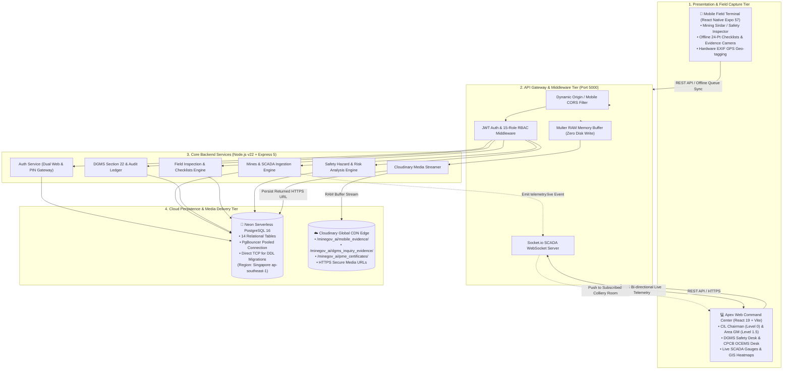
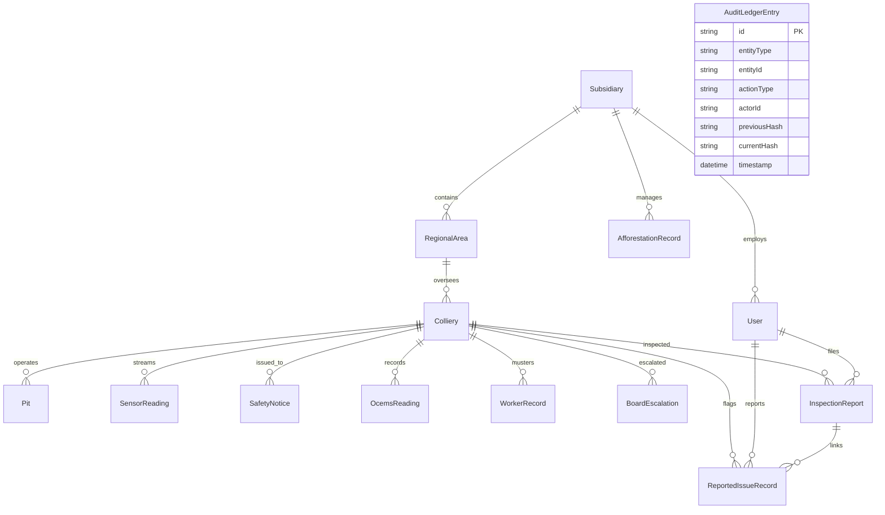

# 🏢 MINEGOV_AI — Apex Command Center & Field Safety Ecosystem

> **Enterprise Statutory Safety, Autonomous Telemetry, Mobile Field Operations & Real-Time SCADA Intelligence Platform**  
> **Mandated for:** Coal India Limited (CIL), Ministry of Coal, DGMS, CPCB & Statutory Regulatory Authorities  
> **Environment:** Neon Serverless PostgreSQL 16 (Singapore) & Cloudinary Global Edge CDN

[](https://nodejs.org/)
[](https://expressjs.com/)
[](https://react.dev/)
[](https://expo.dev/)
[](https://www.prisma.io/)
[](https://neon.tech/)
[](https://cloudinary.com/)
[]()

---

## 📑 Table of Contents

1. [Project Overview & Core Mission](#-project-overview--core-mission)
2. [End-to-End System Architecture](#-end-to-end-system-architecture)
3. [Complete Data Flow (App ➔ Backend ➔ Cloud & DB ➔ Web)](#-complete-data-flow)
4. [Technology Stack](#-technology-stack)
5. [Frontend Web Command Center (`frontend/`)](#-frontend-web-command-center)
6. [Mobile Field Terminal (`mobile_app/`)](#-mobile-field-terminal)
7. [Backend Server & Micro-Services (`backend/`)](#-backend-server--micro-services)
8. [Cloud Infrastructure & CDN Strategy (Cloudinary)](#-cloud-infrastructure--cdn-strategy)
9. [Database Architecture & Schema (Neon PostgreSQL)](#-database-architecture--schema)
10. [Cryptographic Audit Ledger (SHA-256)](#-cryptographic-audit-ledger)
11. [Master Credentials & Persona Matrix](#-master-credentials--persona-matrix)
12. [Environment Variables & Configuration](#-environment-variables--configuration)
13. [Step-by-Step Installation & Running Guide](#-step-by-step-installation--running-guide)
14. [Statutory Mining Regulations (DGMS, CMR 2017, CPCB)](#-statutory-mining-regulations)
15. [Repository Directory Structure](#-repository-directory-structure)

---

## 🌟 Project Overview & Core Mission

**MINEGOV_AI** is a mission-critical multi-client governance and statutory safety ecosystem engineered for **Coal India Limited (CIL)** — the world's largest coal-producing conglomerate (operating 8 subsidiaries, 80+ regional areas, and 300+ mines).

### 🛑 Real-World Industrial Challenges Addressed:
* **The Underground Blind Spot:** Field supervisors (Mining Sirdars) inspecting faces 300 meters underground have zero cellular reception. Traditional clipboard paper logs caused fatal communication delays.
* **Safety Stop-Work Delays:** When hazardous gas spikes ($CH_4 > 1.25\%$, $CO > 50\text{ ppm}$) occurred, issuing statutory **Section 22 stop-work notices** under the Mines Act, 1952 took hours.
* **Audit Alteration & Non-Repudiation:** Traditional databases allow retroactive tampering of accident logs and environmental emission spikes.
* **Database Bloat Anti-Pattern:** Storing high-resolution drone orthomosaics and worker Form 'O' medical X-rays inside SQL databases causes index bloat and query latency degradation.
* **Workforce Health Hazards:** Workers with overdue Periodical Medical Examinations (PME) or pneumoconiosis (Dust Watch) entered hazardous seams due to manual gate register oversights.

### 💡 MINEGOV_AI Solutions:
1. **Offline-First Field Mobile App:** Captures 24-point daily statutory inspections, GPS coordinates, and photos/audio offline; automatically syncs when reaching surface Wi-Fi/LTE.
2. **Real-Time Web Command Center:** Level 0 (Apex CIL) to Level 2 (Mine Manager) and DGMS regulatory desks with live SCADA gas telemetry and Leaflet GIS hotspot maps.
3. **Cryptographic SHA-256 Audit Ledger:** Tamper-proof, blockchain-style chaining for all Section 22 statutory directives.
4. **Dual-Cloud Storage Strategy:** High-speed serverless relational data on Neon PostgreSQL paired with memory-streamed zero-disk media delivery on Cloudinary CDN.
5. **Biometric Gatepass Lockout:** Automated worker turnstile lockout based on medical PME status and MVTR refresher compliance.

---

## 🏗️ End-to-End System Architecture



---

## 🔄 Complete Data Flow

```
+-----------------------------------------------------------------------------------------+
|                                  THE END-TO-END LIFECYCLE                               |
+-----------------------------------------------------------------------------------------+

 [ 1. UNDERGROUND FACE ]
    Mining Sirdar opens Mobile App (-300m depth, No Network).
    - Fills 24-point statutory safety checklist.
    - Flags damaged conveyor belt guard (Item #8) -> ISS-2026-002.
    - Takes camera photo with real EXIF hardware GPS coordinates.
    - Data stored locally in encrypted AsyncStorage queue (`PENDING_SYNC`).
                |
                v
 [ 2. SURFACE PIT-HEAD LAMP ROOM ]
    Sirdar returns to pit-head; mobile detects Wi-Fi / LTE connection.
    - Sync trigger fires: `apiClient.uploadEvidence(photoFile)`.
                |
                v
 [ 3. API GATEWAY & STREAMING ]
    Request hits Express backend (`POST /api/v1/upload`).
    - Multer streams file directly from RAM memory buffer to Cloudinary CDN API.
    - Zero temporary files written to server disk.
    - Cloudinary returns immutable CDN URL: `https://res.cloudinary.com/.../evidence.jpg`.
                |
                v
 [ 4. NEON DATABASE PERSISTENCE ]
    Mobile transmits inspection payload: `POST /api/v1/inspections` and `POST /api/v1/issues`.
    - Backend validates JWT session and stores checklist JSON in Neon PostgreSQL.
    - Database row stores the lightweight Cloudinary HTTPS URL string (~150 bytes).
                |
                v
 [ 5. REAL-TIME SCADA & ALERT DISPATCH ]
    If sensor reading triggers critical threshold (e.g. Methane $CH_4 > 1.25\%$):
    - Node.js WebSocket engine emits `telemetry:live` into colliery room.
    - DGMS Safety Desk and Mine Manager dashboards flash visual audible warnings.
                |
                v
 [ 6. STATUTORY REGULATORY ACTION ]
    DGMS Inspector reviews uploaded photo evidence on Web Command Center.
    - Clicks "Execute Section 22 Stop-Work Order".
    - Backend generates cryptographic SHA-256 hash block linked to previous record hash.
    - Immediate statutory work stoppage enforced with legal non-repudiation.
```

---

## 💻 Technology Stack

| Layer | Component | Technology & Libraries | Rationale & Justification |
| :--- | :--- | :--- | :--- |
| **Web Frontend** | Command Center & Portals | **React 19, Vite, Tailwind CSS, Lucide Icons** | Ultra-fast Vite HMR, concurrent React 19 rendering, military-grade dark command UI aesthetics. |
| **Web Mapping** | GIS Geo-Spatial Heatmaps | **Leaflet, React-Leaflet** | Interactive coordinate markers for colliery locations, active extraction pits, and gas hotspots. |
| **Data Viz** | Real-Time Telemetry Gauges | **D3.js, Visx, Recharts** | High-precision time-series curves for methane, carbon monoxide, and air velocity. |
| **Mobile App** | Field Terminal Client | **React Native, Expo SDK 57, Expo Router** | Cross-platform (Android-first, iOS), file-based routing, hardware camera and location APIs. |
| **Offline Storage** | Mobile Local Persistence | **AsyncStorage, FileSystem** | Guarantees zero data loss in zero-connectivity underground mines. |
| **Backend API** | REST API & Micro-Modules | **Node.js v22, Express 5, TypeScript** | Non-blocking event loop handles high-concurrency SCADA sensor telemetry and multi-client REST queries. |
| **Real-Time Feed**| WebSocket SCADA Feeds | **Socket.io** | Bi-directional streaming of live telemetry with room-based colliery partitioning. |
| **Database** | Serverless Relational DB | **Neon Serverless PostgreSQL 16** | Auto-scaling compute (0.25 to 2 CUs), scale-to-zero cost optimization, separation of compute and storage. |
| **ORM & Driver** | Schema & Connection Pool | **Prisma 7 (`@prisma/client` + `@prisma/adapter-pg`)** | Full end-to-end type safety, driver adapter pattern with Neon PgBouncer transaction pooling. |
| **Media Storage** | Cloud Object CDN | **Cloudinary (`cloudinary` + `multer`)** | RAM-buffered direct upload preventing PostgreSQL binary bloat; global CDN image delivery. |
| **Authentication**| Identity & Security | **JWT (JSON Web Tokens), Bcryptjs** | Multi-tier RBAC supporting Web email/password and Mobile 4-digit statutory PINs. |
| **Audit Ledger** | Cryptographic Proof | **Node.js Native Crypto (SHA-256)** | Blockchain-style immutable hash chain guaranteeing non-repudiation of Section 22 orders. |

---

## 🖥️ Frontend Web Command Center (`frontend/`)

The web frontend is a command-and-control portal built with **React 19** and **Vite**.

### Core Modules & Dashboards:
1. **Landing & Access Gateway (`/`)**:
   - High-impact operational overview, emergency DGMS bulletin banner, national metrics ticker.
   - Quick-switch persona modal for demonstrating any of the 13 role-based portals.
2. **CIL Apex Command Center (`/cil-dashboard`) — Level 0**:
   - National production target vs actual pace (780 MT annual target).
   - Subsidiary comparative scorecard (BCCL, ECL, CCL, SECL, etc.).
   - National coal rail rake dispatches and pit-head stock reserves.
3. **Subsidiary & Area Command (`/regional-area`) — Level 1 & 1.5**:
   - Area GM matrix for Katras, Kusmunda, Singrauli areas.
   - Interactive GIS Leaflet map highlighting environmental and safety hazard hotspots.
4. **Mine Manager Dashboard (`/mine-manager`) — Level 2**:
   - Colliery shift muster management (Shift A, B, C).
   - Real-time SCADA gas gauge readouts ($CH_4, CO$, Airflow, Roof Convergence).
   - Biometric gatepass turnstile monitor: Automatically denies entry to workers with overdue PME or Dust Watch status.
5. **DGMS Statutory Regulatory Gateway (`/regulatory-gateway`)**:
   - Active Section 22 Stop-Work Notices table.
   - Modal inspection of photographic violation evidence loaded directly from Cloudinary.
   - Digital execution of Section 22 orders with instant SHA-256 cryptographic signing.
6. **CPCB Environmental OCEMS Desk**:
   - Ambient Air Quality Monitoring ($PM_{10}, PM_{2.5}, SO_2, NO_x$).
   - Mine effluent water discharge pH and suspended solids telemetry.
   - Bio-reclamation & afforestation tracker with drone survey overlays.

---

## 📱 Mobile Field Terminal (`mobile_app/`)

The mobile client is engineered with **React Native (Expo SDK 57)** and TypeScript for field supervisors, safety sirdars, and inspectors working underground and on opencast benches.

### Key Capabilities & Engineering Features:
* **Glove-Friendly Login:** Designed for heavy work gloves in rough conditions; uses Employee ID (`TEST-SIR-001`) and a 4-digit statutory PIN (`1234` or `7492`).
* **Offline-First Architecture:** Automatically detects network state. When underground:
  - All 24 statutory checklist items are persisted to local storage.
  - Photos are cached in device storage.
  - Queued records are marked `PENDING_SYNC`.
* **24-Point Statutory Inspection Checklist:** Fully compliant with **Coal Mines Regulations (CMR 2017)**:
  - Ventilation air measurements, methane detector calibration, flame safety lamps.
  - Strata control, roof bolt tension, side dressing, highwall crack checks.
  - Conveyor belt emergency pull-wires, guards, fire extinguishers, water sprinkling.
* **Camera & Hardware GPS Geo-Tagging:**
  - Integrates `expo-camera` and `expo-location` to capture real device coordinates at the spot of violation (zero fabricated coordinates).
* **Automatic Cloud Synchronization:**
  - Upon reaching the surface lamp room, the app connects to Wi-Fi/LTE.
  - Streams evidence to Cloudinary via backend RAM buffer and commits report to Neon PostgreSQL.

---

## ⚙️ Backend Server & Micro-Services (`backend/`)

Built with **Node.js v22**, **Express 5**, and **TypeScript**, the backend acts as the central API gateway, SCADA broadcaster, and statutory ledger.

### API Module Overview:

| Endpoint Route | Method | Description | Auth Required |
| :--- | :---: | :--- | :---: |
| `GET /api/health` | `GET` | Live health probe & Neon cloud database ping | Public |
| `/api/v1/auth/login` | `POST` | Dual login: Email/Password (Web) or Employee ID/PIN (Mobile) | Public |
| `/api/v1/auth/me` | `GET` | Returns authenticated user identity, role, and jurisdiction | JWT |
| `/api/v1/auth/demo-users` | `GET` | Returns list of pre-seeded demo accounts for quick role-switching | Public |
| `/api/v1/upload` | `POST` | Multer RAM buffer streaming direct to Cloudinary CDN | JWT |
| `/api/v1/inspections` | `GET, POST` | Ingests mobile 24-point checklists and fetches historical logs | JWT |
| `/api/v1/inspections/:id` | `GET` | Returns complete checklist JSON with linked hazard reports | JWT |
| `/api/v1/issues` | `GET, POST` | Logs field safety hazards with GPS, AI risk score & Cloudinary URLs | JWT |
| `/api/v1/issues/:id` | `GET` | Returns single issue details with evidence photo previews | JWT |
| `/api/v1/cil/overview` | `GET` | National production rollup (780 MT), despatches, scorecard | JWT |
| `/api/v1/cil/safety-desk` | `GET` | DGMS inquiries, national LTIFR safety statistics | JWT |
| `/api/v1/cil/safety/execute-sec22` | `POST` | Issues Section 22 order, signs with SHA-256 audit ledger | JWT (Chairman/DGMS) |
| `/api/v1/cil/environment` | `GET` | CPCB OCEMS telemetry breaches and afforestation progress | JWT |
| `/api/v1/cil/audit-ledger` | `GET` | Returns full immutable SHA-256 cryptographic audit chain | JWT |
| `/api/v1/regional/matrix` | `GET` | Regional Area GM operational scorecards and colliery KPIs | JWT |
| `/api/v1/regional/gis-hotspots` | `GET` | GeoJSON coordinates for GIS map overlay | JWT |
| `/api/v1/mines/:id/telemetry` | `GET, POST` | SCADA sensor telemetry ingestion and real-time readouts | JWT |
| `/api/v1/mines/:id/workforce` | `GET` | Workforce muster, PME status, and biometric gate lockout status | JWT |

---

## ☁️ Cloud Infrastructure & CDN Strategy

### ❌ Why Media is NEVER Stored in PostgreSQL:
1. **Database Bloat:** Storing raw high-res images in PostgreSQL via `BYTEA` or Base64 inflates database size 10x to 100x.
2. **RAM Buffer Thrashing:** Large BLOBs swamp PostgreSQL's shared buffer pool, degrading cache hit ratios and slowing SQL query performance.
3. **Sluggish Backups & Point-in-Time Recovery:** Database snapshots, replication streams, and failover operations become bottlenecked.

### ✅ The MINEGOV_AI Dual-Cloud Strategy:
* **Multer Memory Storage (`multer.memoryStorage()`):** Uploaded files are piped into transient RAM buffers — **zero temporary files are written to server disk**.
* **Cloudinary CDN Upload Pipeline:** Backend pipes the RAM stream directly into Cloudinary's encrypted global CDN with dedicated statutory folders:
  - `minegov_ai/mobile_evidence/` — Photos & audio from underground mobile inspections
  - `minegov_ai/dgms_inquiry_evidence/` — Highwall cracks, gas leaks, and Section 22 violation proof
  - `minegov_ai/pme_certificates/` — Worker Form 'O' medical records and chest X-rays
  - `minegov_ai/hazard_maps/` — Colliery ventilation schematics and haul road maps
* **Compact Relational Pointers:** Neon PostgreSQL stores only the immutable HTTPS CDN link (e.g., `https://res.cloudinary.com/.../image.jpg`), keeping rows lean (~150 bytes) and lightning-fast.

---

## 🐘 Database Architecture & Schema

Hosted on **Neon Serverless PostgreSQL 16** (Region: `ap-southeast-1` Singapore) with Prisma 7 ORM.

### Dual-Connection Model:
* **`DATABASE_URL` (Pooled Connection via PgBouncer):** Used by Express and Socket.io at runtime to handle hundreds of concurrent requests without exceeding PostgreSQL connection limits.
* **`DIRECT_URL` (Direct Connection):** Connects directly to the PostgreSQL compute instance for schema migrations (`prisma db push`, `prisma migrate`) which require DDL transactions.

### Entity-Relationship Diagram (14 Core Tables):



### Table Breakdown:
1. `Subsidiary`: 8 CIL companies (BCCL, SECL, CCL, WCL, ECL, MCL, NCL, CMPDIL).
2. `RegionalArea`: Administrative areas (e.g., Katras Area, Kusmunda Area).
3. `Colliery`: Mines (e.g., Moonidih Underground, Gevra Mega Opencast) with geo-coordinates and hazard map URLs.
4. `Pit`: Extraction faces, benches, and sumps.
5. `User`: Personnel profiles across 15 statutory roles.
6. `SensorReading`: Time-series SCADA telemetry ($CH_4, CO$, Airflow, Roof Convergence, $PM_{10}, \text{pH}$, Noise).
7. `SafetyNotice`: Statutory Section 22 stop-work orders with Cloudinary evidence URLs.
8. `OcemsReading`: Ambient air and effluent continuous environmental telemetry.
9. `AfforestationRecord`: Target vs achieved green cover with drone orthomosaic URLs.
10. `WorkerRecord`: Health muster, Form 'O' PME due dates, and biometric turnstile lock flags.
11. `BoardEscalation`: High-priority director-level directives.
12. `InspectionReport`: 24-point daily inspection submissions with checklist JSON and completion metrics.
13. `ReportedIssueRecord`: Field hazard logs with severity, GPS coordinates, and Cloudinary media links.
14. `AuditLedgerEntry`: SHA-256 cryptographic chain entries for immutable regulatory non-repudiation.

---

## 🔒 Cryptographic Audit Ledger (SHA-256)

To guarantee that accident inquiries and statutory Section 22 orders cannot be altered retroactively by any party or database administrator, MINEGOV_AI implements an immutable SHA-256 hash chaining engine:

$$\text{CurrentHash}_n = \text{SHA256}(\text{PreviousHash}_{n-1} + \text{EntityID} + \text{ActionType} + \text{ActorID} + \text{Timestamp})$$

* **Genesis Hash:** `0000000000000000000000000000000000000000000000000000000000000000`
* **Tamper Detection:** If any historical row in PostgreSQL is edited or deleted, recalculating the hash chain immediately breaks validation, mathematically proving unauthorized tampering during regulatory court inquiries.

---

## 🔑 Master Credentials & Persona Matrix

You can log into any portal using the credentials below:

### 🏢 Executive, Management & Regulatory Roles (Web Command Center & Mobile)

| Level / Domain | Role Title | Name / Persona | Email Address | Statutory PIN | Demo Password | Jurisdiction Scope |
| :--- | :--- | :--- | :--- | :---: | :---: | :--- |
| **Level 0** | **CIL Apex Chairman** | P. M. Prasad | `chairman@coalindia.in` | `7492` | `Password@123` | CIL Apex HQ (National Rollup, 8 Subsidiaries) |
| **Level 0** | **Director Technical** | Dr. B. Veera Reddy | `dir.tech@coalindia.in` | `7492` | `Password@123` | CIL Technical Division (HEMM, Mechanization) |
| **Level 1** | **Subsidiary CMD** | Samiran Dutta | `cmd.bccl@coalindia.in` | `7492` | `Password@123` | Bharat Coking Coal Limited (BCCL HQ, Dhanbad) |
| **Level 1.5** | **Area General Manager** | A. K. Sharma | `gm.katras@bccl.gov.in` | `7492` | `Password@123` | Katras Regional Area (Collieries & Hotspots) |
| **Level 2** | **Mine Manager (1st Class)** | R. K. Singh | `manager.moonidih@bccl.gov.in` | `7492` | `Password@123` | Moonidih Deep Seam UG Mine (Pit Operations) |
| **Regulator** | **DGMS Safety Inspector** | Prabhat Kumar | `safety.katras@dgms.gov.in` | `7492` | `Password@123` | DGMS Central Regulatory Desk (Section 22 Authority)|
| **Regulator** | **CPCB OCEMS Officer** | Sunita Narain | `env.dhanbad@cpcb.gov.in` | `7492` | `Password@123` | CPCB Regional Desk (Air & Effluent Compliance) |

---

### 📱 Field Operations Roles (Mobile App & Field Desks)

Mobile field terminals allow miners and supervisors to authenticate using **Employee ID** and **4-digit PIN** for fast access wearing heavy industrial gloves:

| Role Title | Employee ID | Name | Statutory PIN | Password | Reporting Domain | Core Field Duties |
| :--- | :---: | :--- | :---: | :---: | :---: | :--- |
| **Mining Sirdar** | `TEST-SIR-001` | Ramesh Kumar | `1234` or `7492` | `Password@123` | **Safety** | 24-point statutory checklist, face ventilation, highwall stability. |
| **Safety Inspector** | `TEST-SI-001` | Amit Verma | `1234` or `7492` | `Password@123` | **Safety** | Equipment lockout/tagout, DGMS compliance audits. |
| **Technical / Competent Person** | `TEST-TECH-001` | Vikash Singh | `1234` or `7492` | `Password@123` | **Safety** | HEMM mechanical checks, conveyor guards, cable earthing. |
| **Environment Officer** | `TEST-ENV-001` | Sudhanshu Sharma | `1234` or `7492` | `Password@123` | **Environment** | Haul road dust suppression, OCEMS sensors, water misting. |
| **Production Officer** | `TEST-PROD-001` | Rohit Kumar | `1234` or `7492` | `Password@123` | **Production** | Face coal extraction, shovel-dumper matching, haulage tally. |
| **Labour Welfare Officer** | `TEST-WEL-001` | Priya Kumari | `1234` or `7492` | `Password@123` | **Labour** | Drinking water, pit sanitation, worker fatigue, PME roster. |

> [!TIP]
> **Universal Demo Fallback:**  
> Any persona can authenticate on Web or Mobile using PIN **`7492`**, PIN **`1234`**, or password **`Password@123`**.

---

## ⚙️ Environment Variables & Configuration

### 1. Backend Server (`backend/.env`)
```env
# Server Configuration
PORT=5000
NODE_ENV=development
CLIENT_URL=http://localhost:5173

# JWT Secret & Expiration
JWT_SECRET=your_jwt_secret_key_here
JWT_EXPIRES_IN=7d

# Neon Serverless PostgreSQL Database URLs (Get from your Neon Console)
# 1. Pooled Connection (Used by Prisma Client in Express & Socket.io runtime)
DATABASE_URL="postgresql://<user>:<password>@<ep-pooler-id>.ap-southeast-1.aws.neon.tech/neondb?sslmode=require"

# 2. Direct Connection (Used by Prisma CLI for migrations and schema pushing)
DIRECT_URL="postgresql://<user>:<password>@<ep-direct-id>.ap-southeast-1.aws.neon.tech/neondb?sslmode=require"

# Cloudinary CDN & Media Storage (Get from your Cloudinary Dashboard)
CLOUDINARY_CLOUD_NAME="your_cloud_name"
CLOUDINARY_API_KEY="your_cloudinary_api_key"
CLOUDINARY_API_SECRET="your_cloudinary_api_secret"
CLOUDINARY_URL="cloudinary://<api_key>:<api_secret>@<cloud_name>"
```

### 2. Mobile App (`mobile_app/.env`)
```env
# Point to your backend IP address (use your local LAN IP for physical Expo Go devices)
EXPO_PUBLIC_API_URL=http://localhost:5000/api/v1
```

---

## 🚀 Step-by-Step Installation & Running Guide

### Prerequisites
* **Node.js:** v20.x or v22.x LTS installed
* **npm:** v10.x or higher
* **Active Internet Connection:** Required to connect to Neon PostgreSQL and Cloudinary CDN

---

### Step 1: Start the Backend Server (Port 5000)

```bash
# Navigate to backend folder
cd MINEGOV_AI/backend

# Install dependencies (if first time)
npm install

# Start Express & WebSocket SCADA Server
npm run dev
```
*Expected Console Output:*
```text
🚀 MINEGOV_AI Apex Backend running on http://localhost:5000
🐘 Connected to Neon PostgreSQL (development mode)
📡 WebSocket SCADA Engine ready for incoming feeds
```

---

### Step 2: Start the Web Command Center (Port 5173)

```bash
# In a new terminal window:
cd MINEGOV_AI/frontend

# Install dependencies (if first time)
npm install

# Launch Vite development server
npm run dev
```
*Open your web browser:* `http://localhost:5173`

---

### Step 3: Start the Mobile Field Terminal (Expo)

```bash
# In a new terminal window:
cd MINEGOV_AI/mobile_app

# Install dependencies (if first time)
npm install

# Start Expo Development Server
npm run start
```
*Options to run:*
* Press **`w`** in terminal to open in the browser.
* Press **`a`** to launch on an active Android emulator.
* Open the **Expo Go** app on your physical smartphone and scan the displayed QR code (ensure phone and PC are on the same Wi-Fi).

---

### Step 4: Verification & Live Database Inspection

1. **Verify Backend Health Endpoint:**
   ```bash
   curl http://localhost:5000/api/health
   ```
2. **Launch Visual Database Studio (Prisma Studio):**
   ```bash
   cd MINEGOV_AI/backend
   npx prisma studio
   ```
   *Opens visual database browser at:* `http://localhost:5555`  
   *Allows live inspection of all 14 PostgreSQL tables, foreign keys, and audit entries.*

3. **Run End-to-End Integration Test Suite:**
   ```bash
   node MINEGOV_AI/test_integration.mjs
   ```
   *Executes automated login, inspection submission, and hazard issue creation with real Cloudinary CDN links.*

---

## 📜 Statutory Mining Regulations

MINEGOV_AI's business logic is built directly upon Indian statutory mining legislation:

1. **Mines Act, 1952 — Section 22:**
   - Gives statutory authority to DGMS Inspectors and CIL Chairman to issue immediate stop-work directives whenever there is imminent danger to life.
   - Digitized with immutable SHA-256 cryptographic signatures.
2. **Coal Mines Regulations, 2017 (CMR 2017):**
   - **CMR 153 (Gassy Seams):** Mandates methanometers and flame safety lamps. Threshold set at $CH_4 > 1.25\%$ for immediate evacuation.
   - **CMR 123 (Strata Control):** Systematic support rules for roof bolts and side dressing to prevent cave-ins.
   - **CMR 24-Point Inspection Checklist:** Daily pre-shift statutory inspection codified into the mobile app.
3. **CPCB OCEMS (Central Pollution Control Board):**
   - Mandates continuous online effluent and emission monitoring ($PM_{10}, PM_{2.5}, SO_2, \text{pH}$).
4. **Periodical Medical Examination (PME Form 'O'):**
   - Workers diagnosed with pneumoconiosis or failing fitness are tagged as `DUST_WATCH` or `UNFIT`, triggering automatic biometric turnstile lockouts at the pit head.

---

## 📁 Repository Directory Structure

```text
MINEGOV_AI/
├── backend/                               # Node.js + Express 5 + TypeScript Server
│   ├── prisma/
│   │   └── schema.prisma                  # 14 Relational Models & Enums
│   ├── src/
│   │   ├── config/
│   │   │   ├── cloudinary.ts              # Memory-buffered Cloudinary Client
│   │   │   ├── db.ts                      # Neon PgBouncer Connection Adapter
│   │   │   └── env.ts                     # Validated Environment Variables
│   │   ├── middleware/
│   │   │   ├── auth.middleware.ts         # JWT & 15-Role RBAC Middleware
│   │   │   └── cors.middleware.ts         # Permissive Dynamic CORS Engine
│   │   ├── modules/
│   │   │   ├── auth/                      # Dual Web & PIN Authentication
│   │   │   ├── cil/                       # Apex Rollup, DGMS Desk & Ledger
│   │   │   ├── inspections/               # Mobile 24-Point Checklist Sync
│   │   │   ├── issues/                    # Field Hazards & GPS Reports
│   │   │   ├── mines/                     # SCADA Ingestion & Workforce Muster
│   │   │   ├── regional/                  # Area Matrix & GIS GeoJSON Hotspots
│   │   │   └── upload/                    # RAM-streamed Cloudinary Ingestion
│   │   └── server.ts                      # Express App & Socket.io SCADA Engine
│   ├── .env                               # Active Cloud Database & Cloudinary Keys
│   ├── .env.example                       # Reference Configuration Template
│   └── package.json
│
├── frontend/                              # React 19 + Vite Web Command Center
│   ├── src/
│   │   ├── pages/
│   │   │   ├── cil-dashboard/             # Level 0 Apex CIL Headquarters
│   │   │   ├── Subsidary-dashboard/       # Level 1 Subsidiary CMD Command
│   │   │   ├── Reginal_Area/              # Level 1.5 Area GM Matrix & GIS Map
│   │   │   └── MineManager/               # Level 2 Mine Operations & Gas SCADA
│   │   ├── views/
│   │   │   ├── LandingPage.jsx            # Public Hero & Statutory Bulletins
│   │   │   ├── AccessGateway.jsx          # Multi-Persona Role Selector
│   │   │   └── RegulatoryGateway.jsx      # DGMS Section 22 Enforcement Desk
│   │   ├── services/                      # API Client & WebSocket Telemetry Feeds
│   │   ├── App.jsx                        # React Router Config
│   │   └── main.jsx
│   ├── package.json
│   └── vite.config.js
│
├── mobile_app/                            # React Native Expo SDK 57 Field Terminal
│   ├── app/
│   │   ├── (auth)/
│   │   │   └── login.tsx                  # Glove-Friendly Employee ID & PIN Login
│   │   ├── (main)/
│   │   │   └── index.tsx                  # Domain Selector (Safety/Env/Prod/Labour)
│   │   └── safety/sirdar/
│   │       ├── daily-inspection.tsx       # 24-Point Statutory Inspection
│   │       ├── report-issue.tsx           # Hazard Camera, GPS & Risk Analyzer
│   │       └── index.tsx                  # Sirdar Shift Landing
│   ├── src/
│   │   ├── services/
│   │   │   ├── api-client.ts              # Unified Backend & Cloudinary Sync
│   │   │   └── field-services-impl.ts     # Hardware GPS & Risk Analyzer
│   │   ├── storage/                       # Encrypted AsyncStorage Offline Queue
│   │   ├── permissions/                   # Role-to-Domain Permission Matrix
│   │   └── constants/theme.ts             # Light Surface & Navy Design System
│   ├── .env                               # Mobile API Endpoint Configuration
│   ├── app.json
│   └── package.json
│
├── implementation_plan.md                 # Deep Architectural & Interview Guide
├── MINE_MANAGER_DATA_REQUIREMENTS.md      # Statutory Colliery Muster Specifications
├── test_integration.mjs                   # Automated Full-Stack Verification Script
└── README.md                              # This Master Documentation File
```

---

## 🏆 Summary Checklist for Demonstrations & Interviews

* [x] **Zero Mock Data:** Powered live by Neon Serverless PostgreSQL in Singapore.
* [x] **Zero SQL Bloat:** Photos and media stream through RAM directly to Cloudinary CDN.
* [x] **Offline-First:** Mobile terminals preserve inspection drafts and evidence underground without internet.
* [x] **Statutory Legal Integrity:** DGMS Section 22 orders sealed with an immutable SHA-256 cryptographic chain.
* [x] **Multi-Tier Hierarchy:** Seamless demoing from CIL Apex Chairman down to Underground Mining Sirdar.

---

*Engineered with precision for Coal India Limited and statutory regulatory bodies.*
